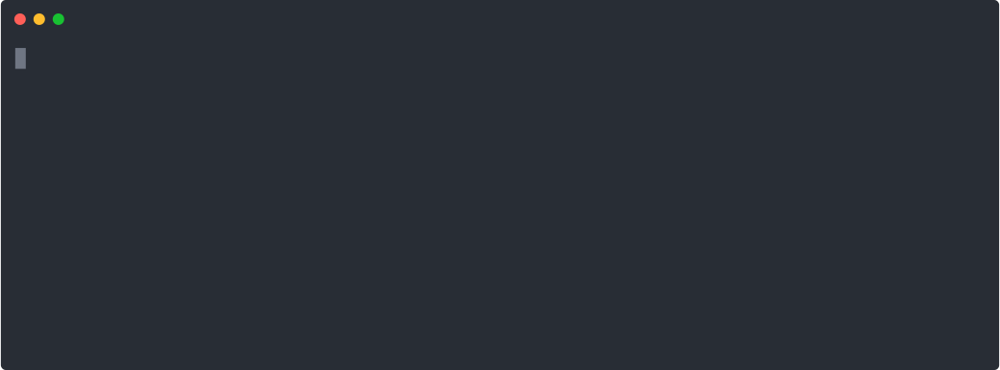

# flarepilot

Dokku/Heroku/Fly.io-style deployments on Cloudflare Containers.

<p align="center">
  <br>
</p>

See it in action loading this app multiple times to see how location and uptime behaves:

<a href="https://flarepilot-snowy-hill-6237.tag-concierge.workers.dev/" target="_blank">Live demo</a>

or from command line:

```
curl https://flarepilot-old-star-5126.tag-concierge.workers.dev/
```

## What is this?

Flarepilot is a CLI that deploys and manages containerized apps on Cloudflare's global network. No wrangler dependency - it talks directly to the Cloudflare API.

Under the hood, each app is a Cloudflare Worker backed by Durable Objects running your container image. A bundled worker template handles load balancing across your configured regions and instances.

**Two components:**

- **CLI** (`flarepilot`) - builds your Docker image, pushes it to Cloudflare's container registry, deploys the worker, and manages configuration. All state lives in the Cloudflare API - the only local file is your auth token.
- **Worker template** - a lightweight router that reads your app config from an environment binding, picks the closest region based on the request's origin, and distributes traffic across instances.

## Features

- **One-command deploy** - `flarepilot deploy` builds your Dockerfile, pushes to Cloudflare's registry, and deploys. Live Docker-based app on Cloudflare within a couple of minutes.
- **Instance load balancing** - run multiple instances per region in multiple regions. Traffic is distributed across them.
- **Multi-region scaling** - use `locationHints` for basic multi-region deployments.
- **Easy config updates** - change env vars, scaling, and custom domains without redeploying your image.
- **Custom domains** - interactive zone picker, automatic DNS record creation, root or subdomain routing.
- **Zero external dependencies** - no wrangler, no KV, no external databases, only a Cloudflare API token

## Quick start

```sh
npm install -g flarepilot

# Authenticate (opens a pre-filled token creation page)
flarepilot auth

# Deploy from a Dockerfile
flarepilot deploy myapp ./path/to/app

# Check status
flarepilot ps myapp

# Open in browser
flarepilot open myapp
```

## Commands

```
flarepilot auth                    Authenticate with Cloudflare
flarepilot deploy [name] [path]    Deploy an app from a Dockerfile
flarepilot apps                    List all deployed apps
flarepilot apps info [name]        Show detailed app information
flarepilot apps destroy [name]     Destroy an app and its resources
flarepilot ps [name]               Show app containers and status
flarepilot logs [name]             Stream live logs
flarepilot open [name]             Open app in browser
flarepilot config show [name]      Show env vars
flarepilot config set KEY=VALUE    Set env vars (live)
flarepilot config unset KEY        Remove env vars (live)
flarepilot config import -f .env   Import from .env file
flarepilot scale [name]            Show or adjust scaling
flarepilot domains add             Add a custom domain (interactive)
flarepilot domains list [name]     List custom domains
flarepilot domains remove <domain> Remove a custom domain
flarepilot regions                 List available regions
flarepilot doctor                  Check system setup
```

## Scaling

```sh
# Single region, multiple instances
flarepilot deploy myapp . --regions enam -i 4

# Multiple regions, 1 instance each
flarepilot deploy myapp . --regions wnam,weur,apac -i 1

# Adjust after deploy
flarepilot scale myapp -i 4
flarepilot scale myapp --instance-type standard
flarepilot scale myapp --vcpu 1 --memory 512
```

Regions are Durable Object `locationHints` - Cloudflare will attempt to place containers near the requested region but exact placement is not guaranteed. Run `flarepilot regions` to see all 9 available regions.

## FAQ

### Can't I do all of this with wrangler?

Short answer, yes. Wrangler CLI and wrangler.toml file can handle any Cloudflare feature.
On the other hand, wrangler is Worker-centric and not very convenient for Docker-based container deployments.
Flarepilot adds the app-level abstractions on top, so you can deploy any Docker application without dealing with Workers specifics.

### Do I need a Cloudflare account?

Yes. You need a Cloudflare account with Containers enabled. The CLI will guide you through creating an API token with the right permissions during `flarepilot auth`.

### How does it load balance across multiple regions?

Each request hits a Cloudflare Worker at the nearest edge location. The worker reads Cloudflare's geo data from the request, maps it to the closest configured region, and routes to a random instance in that region using Durable Object location hints.

### How does scaling work?

Scaling is lazy and happens at the load balancer level. When you scale up (e.g., increase instances from 2 to 4), new instances are not created immediately - the load balancer will create them on the next incoming request. When you scale down, existing instances are not stopped or removed right away. They will eventually sleep and be reclaimed based on the `sleepAfter` parameter (default 30s of inactivity). This simple strategy keeps the implementation straightforward and will be improved in the future.

### Does it autoscale?

Not currently. You set the number of instances per region and Flarepilot maintains that count. Containers do sleep after a configurable idle period (default 30s) and wake on the next request, so you're not paying for idle instances.

## Requirements

- Node.js 20+
- Docker (for building images)
- Cloudflare account with Containers access (paid Workers plan)

## License

MIT
